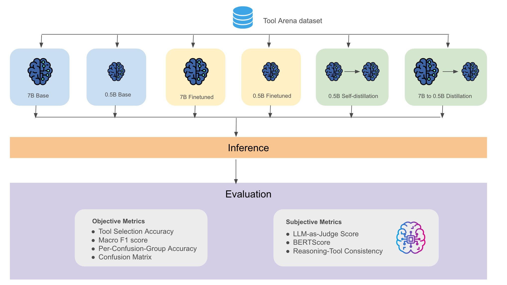

# ToolArena 🛠️

**A confusion-attack tool-calling benchmark for LLMs**

Most tool-calling benchmarks give models obviously distinct options. ToolArena doesn't. Candidate sets are stacked with semantically similar tools from the same confusion group, making the task genuinely hard and exposing whether a model actually understands tool semantics or just pattern-matches on surface keywords.

The benchmark demo covers six model variants (two base, two fine-tuned, two distilled) on a 28-tool Business Intelligence domain, with both objective metrics and subjective metrics.



## Motivation

Real tool-calling deployments are messy — tools in the same system often have overlapping purposes and similar names (e.g. `aggregate_metric` vs. `compute_rolling_average` vs. `compute_cumulative_sum`). Standard benchmarks don't test for this.

ToolArena targets that failure mode with a **confusion-attack evaluation**:

- Tools are grouped into **8 confusion groups** of 2–4 semantically similar tools.
- Each candidate set is filled **75% from the same confusion group** as the correct tool.
- Difficulty levels (easy / medium / hard) control how explicitly the query signals the right answer.

This reliably separates models that understand tool semantics from those guessing on keywords.

## Benchmark Design

### Tools and Confusion Groups

28 tools across 8 confusion groups in the Business Intelligence (BI) domain:

| Confusion Group | Tools |
|---|---|
| `aggregation_vs_window` | `aggregate_metric`, `compute_rolling_average`, `compute_cumulative_sum` |
| `filtering_vs_segmentation` | `filter_records`, `segment_by_dimension`, `apply_cohort_filter` |
| `trend_vs_forecast` | `compute_trend_line`, `generate_forecast`, `detect_seasonality` |
| `ranking_vs_topn` | `rank_entities`, `get_top_n_records`, `compute_percentile_rank` |
| `comparison_vs_benchmarking` | `compare_periods`, `benchmark_against_target`, `compute_variance_from_baseline` |
| `export_vs_report` | `export_to_csv`, `generate_summary_report`, `create_dashboard_snapshot` |
| `schema_vs_metadata` | `describe_dataset`, `get_column_statistics`, `list_available_metrics` |
| `correlation_vs_causation` | `compute_correlation`, `run_regression_analysis`, `detect_anomaly` |

### Sample Schema

```json
{
  "id": "a3f9...",
  "query": "What was the total revenue last quarter?",
  "correct_tool": "aggregate_metric",
  "correct_tool_args": {"metric_column": "revenue", "aggregation_function": "sum"},
  "candidate_tools": [ ... ],
  "confusion_group": "aggregation_vs_window",
  "difficulty": 1,
  "distractor_tools": ["compute_rolling_average", "compute_cumulative_sum", ...],
  "reference_reasoning": "The query asks for a single total figure, not a rolling or cumulative computation ...",
  "rationale": "aggregate_metric is used when the query requests a single summary statistic."
}
```

## Model Variants

| Variant | Base Model | Method | Quantization |
|---|---|---|---|
| `base-big` | `Qwen/Qwen2.5-7B-Instruct` | None (zero-shot) | 4-bit |
| `base-small` | `Qwen/Qwen2.5-0.5B-Instruct` | None (zero-shot) | None |
| `finetuned-big` | `Qwen/Qwen2.5-7B-Instruct` | SFT + LoRA | 4-bit |
| `finetuned-small` | `Qwen/Qwen2.5-0.5B-Instruct` | SFT + LoRA | None |
| `self-distilled-base-small` | `Qwen/Qwen2.5-0.5B-Instruct` | Self-KD + LoRA | None |
| `distilled-base-big-to-base-small` | `Qwen/Qwen2.5-0.5B-Instruct` | KD from 7B + LoRA | None |

All variants use the same Qwen family for fair tokenizer compatibility and consistent distillation.

## Evaluation Metrics

### Objective Track

| Metric | Description | RAG Analogue |
|---|---|---|
| Tool Selection Accuracy | Fraction of samples with correct tool | Context Recall |
| Macro F1 | F1 averaged equally across all 28 tool classes | — |
| Per-Confusion-Group Accuracy | Accuracy per confusion group | — |
| Confusion Matrix | Full 28×28 matrix | — |

### Subjective Track

| Metric | Description | RAG Analogue |
|---|---|---|
| LLM-as-Judge Score (1–5) | Reasoning quality scored by the judge LLM | Answer Relevance |
| BERTScore F1 | Semantic similarity between generated and reference reasoning | Answer Semantic Similarity |
| Reasoning-Tool Consistency | Whether stated reasoning supports the selected tool | Faithfulness |

## Quick Start

### 1. Open in Colab

[](#)

### 2. Run the notebook end-to-end

The notebook is self-contained. Run all sections top-to-bottom.

### 3. Generate the dataset only (script)

```bash
python core/dataset_generator.py --domain bi --n 25000 --seed 100
python core/subset_sampler.py --n 200 --seed 100
```

### 4. Evaluate a single model variant

```python
from core.model_predictor import ModelPredictor
from core.evaluator import EvalRunner
from core.subset_sampler import StratifiedSampler

sampler = StratifiedSampler(seed=42)
subset  = sampler.sample("datasets/bi/demo_subset.jsonl", n=200)
_, _, test = sampler.compute_splits(subset)

predictor = ModelPredictor.from_pretrained(
    "Qwen/Qwen2.5-0.5B-Instruct", variant_name="base-small"
)
runner = EvalRunner(wandb_project="ToolArena")
bundle = runner.run(predictor, test, variant_name="base-small")
print(bundle.summary())
```

## Extending to a New Domain

The core is entirely domain-agnostic. Adding a new domain means zero changes to `core/` — just drop two config files:

```
domains/
└── <your_domain>/
    ├── config/tools.json               # Same schema as domains/bi/config/tools.json
    └── templates/query_templates.json  # Same schema as domains/bi/templates/
```

Then pass `domain="<your_domain>"` to any class constructor:

```python
registry = ToolRegistry(domain="finance")
builder  = DatasetBuilder(domain="finance", seed=42)
```
